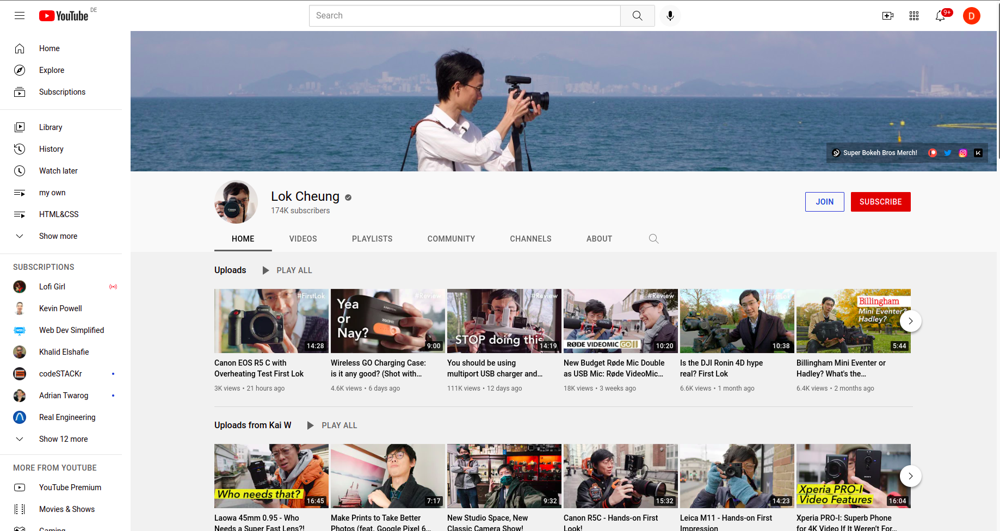

# Youtube Clone

### HTML and CSS Project and soon JAVASCRIPT – to Build A YouTube-Clone page layout.

The CSS Style is Grid for the main layout and flex for the individual items contents layout.

.